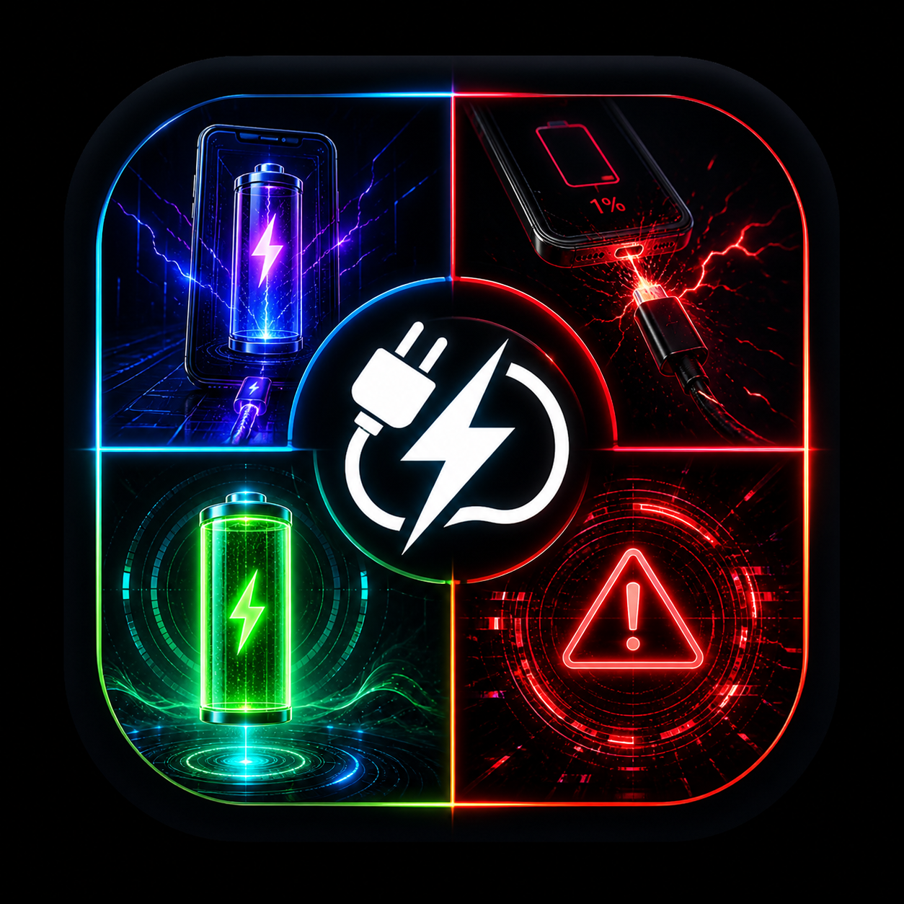

# ⚡ SYSTEM STATUS: ONLINE

  

  

---

### 🌐 NEURAL INTERFACE (Profile Data)

  
  

  

---

### 🛠️ CORE MODULES (Projects)

  

---

### 🛰️ NETWORK CONNECTION (Find Me)

  
  
  

---

### 🧬 CONTRIBUTION GRID

  

  <i>System last synchronized: 2026-05-05</i>

